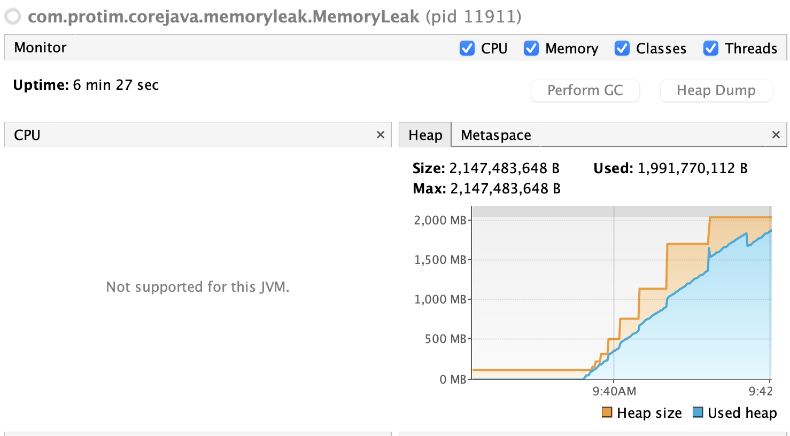
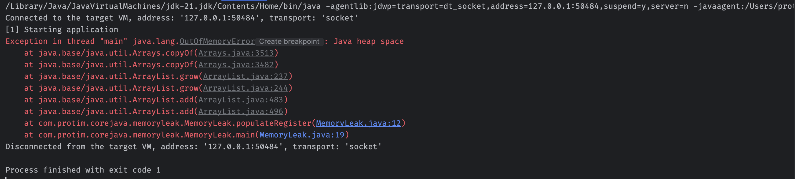

# Understanding Java Memory Leaks via Static Members

This documentation provides an educational overview of how memory leaks occur in Java applications, focusing specifically on the misuse of `static` collection fields. It breaks down the provided simulation code and demonstrates how to monitor and observe this behavior in real-time using **VisualVM**.

---

## 1. What is a Memory Leak in Java?

In Java, memory management is automatically handled by the **Garbage Collector (GC)**. The GC's job is to reclaim heap memory occupied by objects that are no longer "reachable" from any live thread or reference in the application.

A **Memory Leak** occurs when an application retains references to objects that are no longer needed for its business logic. Because a valid path of references still connects a global root to these objects, the Garbage Collector cannot reclaim them. Over time, these accumulating, un-garbage-collected objects consume available heap spaces, inevitably resulting in a `java.lang.OutOfMemoryError: Java heap space`.

### The Core Concept: GC Roots
For an object to be eligible for garbage collection, it must be completely disconnected from any **GC Root**. GC Roots include:
* Active thread execution stacks (local variables within currently running methods).
* System classes loaded by the JVM.
* **Static variables** declared within active classes.

---

## 2. The Danger of Static Members

The `static` modifier completely shifts an object's lifecycle boundary:
1. **Application-Level Longevity:** Static variables belong to the Java `Class` object itself, rather than individual object instances. They are initialized when the class is loaded and remain alive in memory for the entire lifecycle of the JVM process.
2. **Permanent GC Root:** Because a static variable is a permanent GC Root, **any object it references—and any subsequent object nested inside that collection—is strictly immune to garbage collection** unless explicitly cleared, removed, or overwritten.

If a static collection (like an `ArrayList` or `HashMap`) continuously absorbs data without an intentional removal mechanism, it behaves like a permanent data sink, draining memory until the application crashes.

---

## 3. Educational Code Analysis

Here is an architectural breakdown of the provided `MemoryLeak` simulation logic:
Refer [the code here](../com/protim/corejava/memoryleak/MemoryLeak.java)

```java
import java.util.ArrayList;
import java.util.List;

public class MemoryLeak {

    // CRITICAL FAULT: Declaring the list as 'static' means this collection 
    // lives for the duration of the JVM. It is a permanent GC Root.
    public static List<Double> register = new ArrayList<>();

    public void populateRegister() {
        // High-volume loop attempting to inject 100 million Double objects
        for (int i = 0; i < 100_000_000; i++) {
            register.add(Math.random());
        }
        System.out.println("[2] End populating register");
    }

    public static void main(String[] args) {
        System.out.println("[1] Starting application");
        
        // Creating an anonymous instance and running the population loop
        new MemoryLeak().populateRegister();
        
        // Even though the 'new MemoryLeak()' instance is out of scope here,
        // the 'register' list survives because it is tied to the Class, not the instance.
        System.out.println("[3] Ending application");
    }
}
```

### Why this code perfectly illustrates a memory leak:
- The Intention vs. Reality: In main(), new MemoryLeak().populateRegister() creates a short-lived instance to execute a method. A developer might assume that once populateRegister() finishes, the 100 million numbers are no longer needed and can be cleaned up.
- The Reality: Because register is static, all 100 million Double wrappers remain strongly bound to the JVM class definition. Even when step [3] prints and the application pauses or transitions to other tasks, that massive block of memory remains locked, unable to be freed by automatic GC cycles.

## 4. Monitoring the Leak with VisualVM
VisualVM is a powerful visual profiling tool integrated with standard JDK bundles that allows you to observe heap consumption, monitor thread activity, and catch memory leaks in real-time.

Install VisualVM from here: https://visualvm.github.io/download.html

- Launch this program in your IDE, and make sure to add breakpoints near the logs.
- Launch visualVM
- Diagnose the program in debug mode



